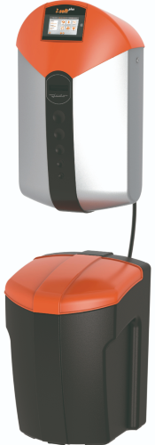

# judoisoftplus
## Version 1.0.0
## Intro
Homeassistant Integration for Judo I-soft Plus - Watersoftening System with leakprotection (with integrated communication software - __without separate connectivity modul__). The integration based on Rest-Api interface. 

__The basis of solution is the rest-api, which you get if add ":8000" to the IP address of the Judo Isoft Plus water softening system in your web browser.__

# Connection
With this solution, only one device can be connected. The following information is needed for the connection:

__The remaining calls of the current Python version can't communicate with the completely outdated REST interface of the Judo-Isoft Plus water softening system because of TLS errors. The solution was to handle the communication through a reverse proxy.__

# Sensors and Button

# Disclaimer
This product is an open-source solution that was developed in our free time. Since we couldn't find any software online for the Judo Isoft Plus version — but urgently needed a solution — this software was programmed for private use. We're happy to share our solution with others this way, but we don't take any responsibility for any damage that might result from using the software.

